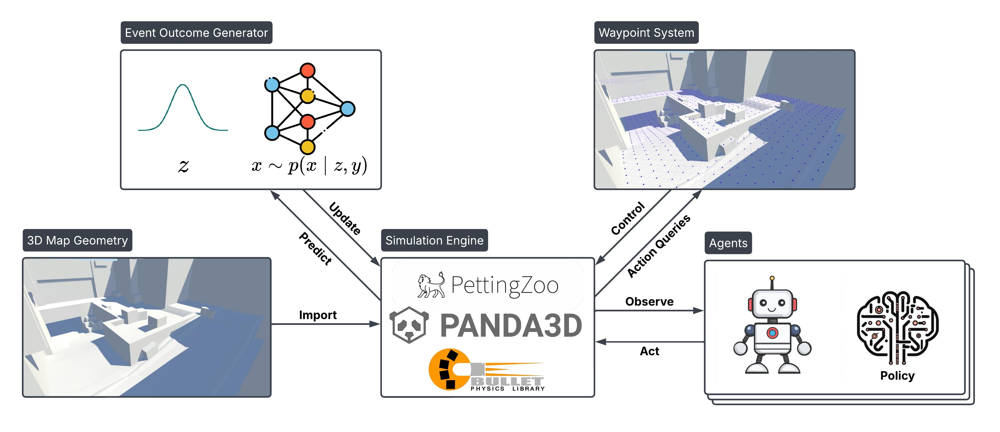

# DECOY

🎯 **A high-fidelity CS:GO simulation environment for strategic multi-agent planning research.** DECOY transforms complex 3D tactical gameplay into efficient discretized simulations while preserving environmental realism. Using neural models trained on real tournament data, it enables researchers to study strategic decision-making without the computational overhead of low-level game mechanics. Perfect for advancing multi-agent AI research in competitive scenarios.



## Quick Start

```bash
python -m venv .venv
source .venv/bin/activate          # Windows: .venv\Scripts\activate
pip install -e .                   # or: pip install -r requirements.txt

python download_decompiled_map.py  # fetches the 75MB de_dust_2.fbx (not in git)
python inspector_demo.py           # spectator view with a random policy
```

Run the tests to confirm the install:

```bash
pytest tests/ -q
```

> **Windows note.** `torch` must be imported before Panda3D; importing them the
> other way round makes torch's DLL load fail with `OSError: [WinError 1114]`.
> `import env` handles this for you, and `conftest.py` does the same for pytest.
> Only torch `< 2.12` is verified here — 2.12–2.14 failed to load on the
> development machine.

## Using the environment

DECOY implements the [PettingZoo](https://pettingzoo.farama.org/) AEC API and
passes `pettingzoo.test.api_test`.

```python
import numpy as np
from env.csgo_environment import env

e = env(num_team_agents=2, seed=0)
e.reset(seed=0)

for agent in e.agent_iter():
    obs, reward, termination, truncation, info = e.last()
    if termination or truncation:
        e.step(None)
        continue
    legal = np.flatnonzero(info["action_mask"])
    e.step(int(np.random.choice(legal)))

print(e.unwrapped.round_outcome())   # (Team.CT, WinReason.TimeOut)
e.close()
```

**Actions** — `Discrete(9)`: eight movement directions over the waypoint graph
(see `env/utils.Direction`) plus an explicit stop. `info["action_mask"]` is an
`int8` array marking which are legal from the current waypoint; stop always is.

**Observations** — `Box` of `12 + 4 * (num_team_agents - 1)` floats:

| slice | contents |
| --- | --- |
| `0:3` | own position |
| `3:4` | own health |
| `4:7` | bomb position |
| `7:12` | bomb status one-hot (`env/utils.BombStatus`) |
| `12:12+3k` | teammate positions |
| rest | teammate healths |

**Rewards** — configurable via `env/rewards.py`; see below.

**Agents act asynchronously.** The simulation runs until an agent reaches its
target waypoint and asks for a decision, so `agent_selection` follows the
engine's decision queue rather than a fixed turn order. `env.last()` therefore
reports the reward accrued *since that agent last acted*. When mapping episodes
to RL transitions, that reward belongs to the agent's **previous** action —
`marl/rollout.py` shows the correct bookkeeping.

### Reset options

```python
e.reset(seed=0, options={
    "player_spawns": {
        "T_0":  {"init_waypoint_id": 3327},
        "CT_0": {"init_pos": (10.0, 4.0, 3.2)},
    },
    "player_weapons":       {"T_0": Weapon.AK_47},
    "player_armor":         {"T_0": True},
    "player_helmet":        {"T_0": True},
    "init_bomb_carrier_id": "T_0",
    "round_id":             "my-round",
})
```

### Known constraint: one environment per process

`CSGOEngine` subclasses Panda3D's `ShowBase`, and Panda3D permits exactly one
per process. **Environments cannot be vectorised in-process.** Call `close()`
before constructing the next one, or run each in its own subprocess.
Constructing a second one raises an explanatory `RuntimeError`.

## Rewards

The environment ships a configurable reward specification (`env/rewards.py`).
Defaults are a documented starting point, not a claim about what the "correct"
reward for competitive CS:GO is.

| term | default | when |
| --- | --- | --- |
| `win` / `lose` | ±1.0 | terminal, to every member of the team |
| `kill` / `death` | ±0.5 | on an agent's health reaching zero |
| `damage_dealt` / `damage_taken` | +0.01 / −0.005 | per HP |
| `bomb_plant` / `bomb_defuse` | +0.3 | to the acting agent |
| `time_penalty` | −0.001 | per decision request |
| `objective_progress` | 0.0 | per unit of graph distance closed on the objective |
| `team_spirit` | 0.0 | fraction of individual reward shared with teammates |

```python
from env.rewards import RewardConfig, SHAPED_REWARD_CONFIG, SPARSE_REWARD_CONFIG
e = env(num_team_agents=2, reward_config=RewardConfig(kill=1.0, team_spirit=0.5))
```

### Why `objective_progress` exists

Measured over 12 random-policy episodes at 2v2: **the bomb is never planted and
CT wins 100% of rounds by timeout.** A random walk over the waypoint graph
diffuses rather than travels, and T spawns ~79 graph-units from the nearest bomb
site. The terminal reward is therefore a constant for each team and carries no
learning signal.

`objective_progress` rewards graph distance closed on the current objective (a
bomb site before the plant, the planted bomb afterwards), using an exact
multi-source Dijkstra distance field rather than straight-line distance, so it
respects walls. Being a difference of a potential over states, it does not
change the set of optimal policies ([Ng, Harada & Russell,
1999](https://people.eecs.berkeley.edu/~russell/papers/icml99-shaping.pdf)) — it
only makes the gradient findable. It defaults to `0.0`; the bundled MARL
baseline turns it on via `SHAPED_REWARD_CONFIG`.

## MARL baseline

`marl/` contains a self-contained IPPO implementation (independent PPO with
parameter sharing inside each team, action masking, GAE) in ~500 lines of
torch + numpy.

```bash
# Train T against a fixed random CT. Win rate is unambiguous evidence of
# learning, because a random T never wins at all.
python -m marl.train --opponent random --total-steps 300000

# Both teams learn simultaneously.
python -m marl.train --opponent selfplay --total-steps 400000
```

Outputs land in `runs/<name>/`: `metrics.csv`, `config.json`, `checkpoint.pt`
and `eval.json`. See [`docs/MARL.md`](docs/MARL.md) for results and
interpretation.

## Repository layout

| path | contents |
| --- | --- |
| `env/` | simulation: engine, agents, waypoint graph, damage model, rewards |
| `marl/` | IPPO baseline: networks, rollout collection, training entry point |
| `trainer/` | training code for the damage models, from replay data |
| `analysis/` | offline trajectory evaluation and timing reports |
| `tests/` | API-conformance and regression tests |
| `models/` | pretrained damage-indicator and damage-outcome checkpoints |

`trainer/` and `analysis/` are packages: run them as modules
(`python -m trainer.main`, `python -m analysis.timing_report`), not as scripts.

## Features

- **Discretized Strategic Planning**: High-level tactical decisions without low-level mechanics
- **Real Data Integration**: Neural models trained on professional CS:GO tournament data
- **Efficient Simulation**: ~1000 agent decisions/second headless at 2v2 on CPU
- **Research Ready**: PettingZoo-compliant, seedable, with a reference MARL baseline

## Roadmap

- [x] MARL training examples
- [ ] Environment customization tools
- [ ] Interactive waypoint visualizer
- [ ] Subprocess-based vectorised rollouts (blocked on the one-ShowBase limit)

# Citation

```bib
@inproceedings{wang2025csgo,
  author    = {Yunzhe Wang and Volkan Ustun and Chris McGroarty},
  title     = {A data-driven discretized {CS:GO} simulation environment to facilitate strategic multi-agent planning research},
  booktitle = {Proceedings of the 2025 Winter Simulation Conference (WSC)},
  year      = {2025},
  address   = {Los Angeles, CA, USA},
  publisher = {IEEE},
}
```
