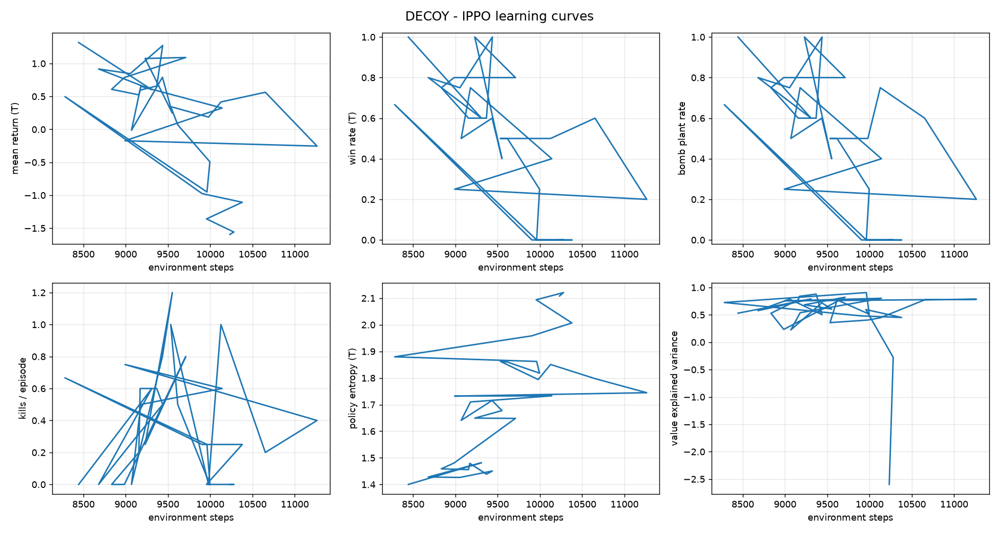

# MARL baseline

`marl/` provides a self-contained IPPO baseline for DECOY: independent PPO with
parameter sharing inside each team, action masking, GAE, and observation
normalisation. It exists to show the environment is trainable and to give a
reference point, not to be a competitive result.

## Running

```bash
# T learns, CT is a fixed random policy.
python -m marl.train --opponent random --total-steps 300000

# Both teams learn simultaneously.
python -m marl.train --opponent selfplay --total-steps 400000

# Plot the curves.
python -m marl.plot runs/ippo-T-vs-random
```

Outputs per run, under `runs/<name>/`:

| file | contents |
| --- | --- |
| `metrics.csv` | one row per PPO iteration |
| `config.json` | full argument, hyperparameter and reward config |
| `checkpoint.pt` | policy weights, optimizer state and observation normaliser |
| `eval.json` | stochastic and greedy evaluation at end of training |
| `curves.png` | written by `marl.plot` |

## Why train against a random opponent

DECOY is competitive and close to zero-sum, so in self-play both teams' returns
move against each other and "reward went up" is not evidence of anything. Against
a **fixed** random opponent the metric is unambiguous:

> Measured over 12 random-policy episodes at 2v2, T **never** plants the bomb and
> CT wins **100%** of rounds by timeout.

So any nonzero T win rate is behaviour that did not exist at initialisation.

## The exploration problem, and the shaping that solves it

A random walk over the waypoint graph diffuses rather than travels. T spawns
about 79 graph-units from the nearest bomb site, and over ~640 decisions a random
policy's net displacement is far smaller than that. The round therefore always
ends in a CT timeout win, the terminal reward is a constant for each team, and
the policy gradient is identically zero.

`RewardConfig.objective_progress` addresses this. At every decision it rewards
the graph distance closed on the current objective — a bomb site before the
plant, the planted bomb afterwards — using an exact multi-source Dijkstra
distance field over the waypoint graph rather than straight-line distance, so it
respects walls.

Because the term is a difference of a potential over states, it is
potential-based shaping in the sense of [Ng, Harada & Russell
(1999)](https://people.eecs.berkeley.edu/~russell/papers/icml99-shaping.pdf) and
does not change the set of optimal policies. It defaults to `0.0`; the bundled
baseline enables it through `SHAPED_REWARD_CONFIG`.

**This is a modelling choice, and it is the one to revisit first** if the
baseline's behaviour looks too eager to rush the site.

## Mapping AEC episodes to PPO transitions

The one genuinely subtle part, handled in `marl/rollout.py`.

Agents act asynchronously — the simulation advances until someone reaches their
target waypoint — so `env.last()` returns the reward accrued *since that agent
last acted*. That reward belongs to the agent's **previous** action, not the one
about to be taken. Each agent therefore carries a pending transition that is
completed on its next turn or at termination.

Getting this wrong shifts every reward by one agent-step. It still trains; it
just trains worse, silently.

GAE is likewise computed within per-agent trajectory segments
(`TeamBatch.segment_ends`), never across the boundary between two agents'
experience.

## Results

### Setup

2v2, T learning against a fixed random CT, `--reward shaped`, seed 0, CPU only.
300k environment steps in **~5.5 minutes** (~850 agent decisions/second). Single
run, no seed averaging — this demonstrates that learning occurs, it is not a
benchmark.

### Evaluation, 30 episodes against a random CT

| policy | T win rate | plant rate | mean return (T) | decisions/episode |
| --- | --- | --- | --- | --- |
| random baseline | **0.00** | 0.00 | −1.54 | 2504 |
| trained, stochastic | **0.70** | 0.70 | +0.72 | 1811 |
| trained, greedy (argmax) | 0.30 | 0.30 | −4.25 | 9310 |

Reproduce with `python -m marl.evaluate runs/ippo-T-vs-random --episodes 30`.

The learned policy goes from never planting to planting in 70% of rounds, and
every win is a `BombDetonated` — it learned to carry the bomb to a site rather
than to win by elimination (kills stay near zero at 0.08 per agent).

### Greedy is *worse* than stochastic here, and that is informative

The argmax policy wins less than half as often and takes **five times as many
decisions per episode** (9310 vs 1811). That signature is a deterministic policy
walking into a local dead end and oscillating between two adjacent waypoints
until the round times out: with no sampling noise there is nothing to break the
cycle. The very negative greedy return is mostly accumulated `time_penalty` from
those wasted decisions, not a worse tactical outcome.

Two consequences worth keeping in mind:

- Report stochastic evaluation for this environment; greedy understates the
  policy. `marl.train` now prints both.
- The residual entropy (~1.7 of a 2.20 maximum) is doing real work. Driving it to
  zero with a larger `--entropy-coef` penalty would likely make the policy worse.

### Learning curve



Plant rate and T win rate are zero for the first ~50k steps while the value
function calibrates (explained variance climbs from −2.6 to ~0.5), then rise
together once the first successful plants appear. Per-iteration win rates are
noisy because a 4096-transition rollout covers only 3-5 episodes.

## Environment performance

Both were on the simulation's hot path. Measured on this machine, CPU only:

| operation | before | after | speedup |
| --- | --- | --- | --- |
| damage model, 50 attacker/victim pairs (5v5) | 20.6 ms | 1.4 ms | **15.2x** |
| nearest waypoint, 500 queries over 6638 nodes | 525.6 ms | 4.5 ms | **117.5x** |

The damage-model figure is a like-for-like comparison of the old per-pair loop
against `predict_damage_batch`; both models run in `eval()` mode, so batching
does not change the damage/no-damage decision (50/50 agreed in the benchmark)
and damage amounts differ only by the generator's sampling noise. The KD-tree
returns bit-identical waypoint ids to the linear scan it replaced.

## Limitations

- **One environment per process.** `CSGOEngine` subclasses Panda3D's `ShowBase`,
  which permits one instance per process, so rollouts cannot be vectorised
  in-process. This is the single biggest throughput constraint; subprocess-based
  vectorisation is the obvious next step.
- **Few episodes per iteration.** A 2v2 round runs ~2500 agent decisions, so a
  4096-transition rollout covers only a handful of episodes. Per-iteration win
  rates are correspondingly noisy; the end-of-training evaluation over more
  episodes is the number to trust.
- **Single seed.** Nothing here is averaged over seeds.
- **Self-play is unevaluated.** `--opponent selfplay` runs, but without a fixed
  reference opponent or an Elo ladder there is no meaningful progress metric for
  it yet.
- **No recurrence.** Observations are Markov only in a loose sense: agents see
  teammates but not opponents, so the task is partially observed and a feedforward
  policy is a real approximation.
